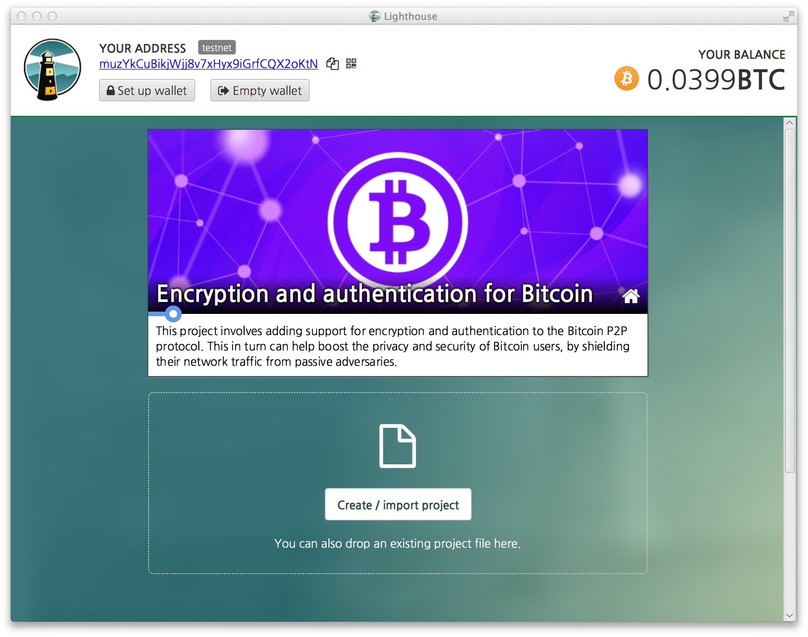
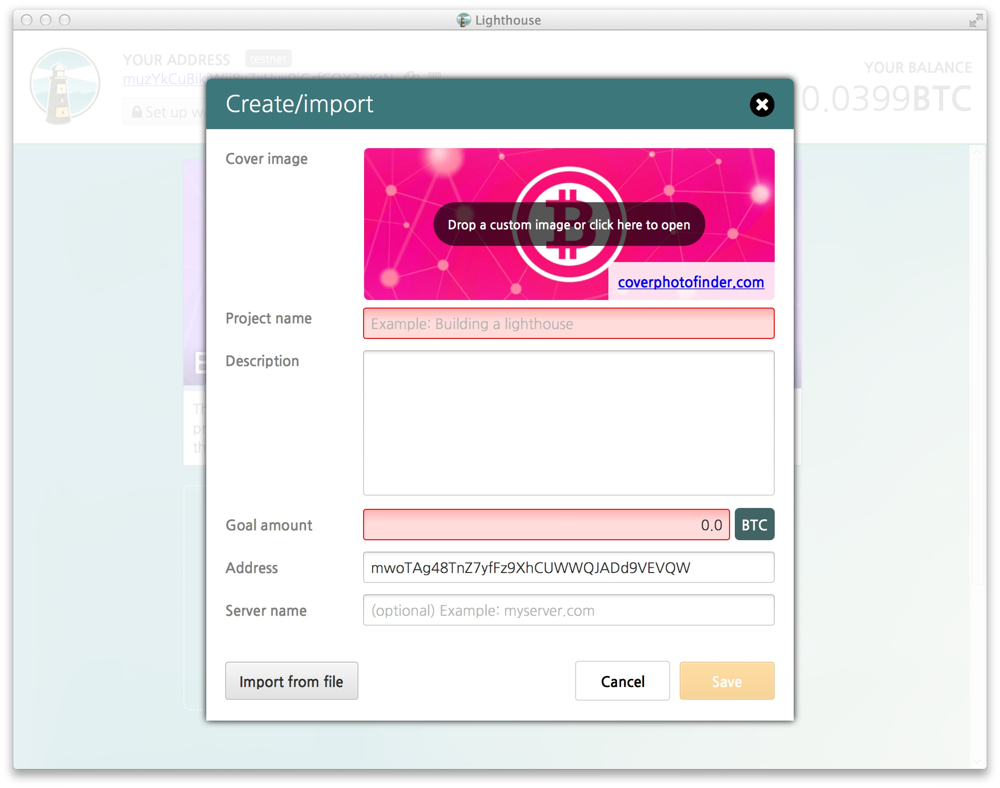
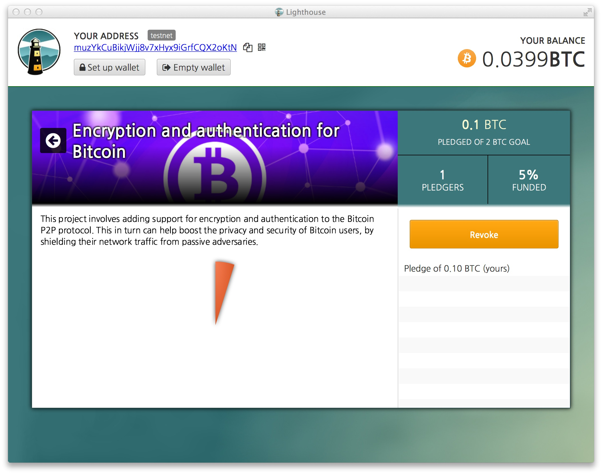
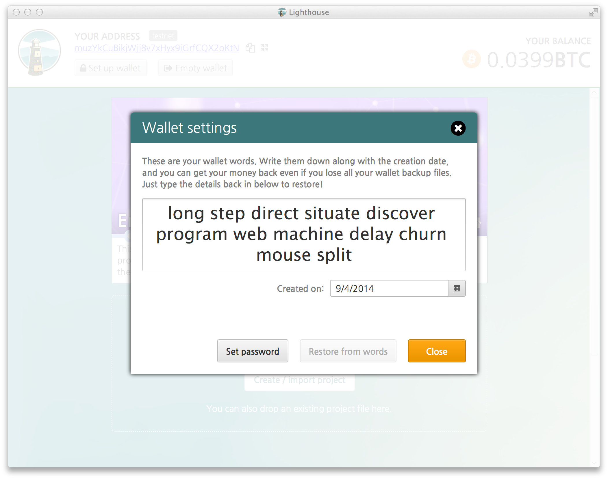

Lighthouse
==========

Lighthouse is a decentralised, peer to peer crowdfunding application that uses the smart contracts features of the
Bitcoin protocol. It lets you create projects and pledge to those projects.

# features

* Pure Bitcoin. No alt coins, no third parties required.
* No fees beyond the usual Bitcoin miner fees (a few cents).
* Can run in both server assisted and a serverless mode, for extra decentralisation.
* Specialised lightweight wallet (SPV+HD).
* Experimental bundled Tor client, for more privacy.
* Runs on Windows, Mac and Linux.

# status

Lighthouse is in _ALPHA_. It currently is hard-coded to the Bitcoin test network so you can't crowdfund with real coins.
It has various glitches and missing bits. Once enough polish has been done we'll switch to the main Bitcoin network and
go to beta. Read the [list of tasks to reach beta](https://github.com/vinumeris/lighthouse/milestones/beta).

# get involved

Mailing lists:

* [User discussion and questions](https://groups.google.com/forum/#!forum/lighthouse-discuss)
* [Development talk](https://groups.google.com/forum/#!forum/lighthouse-dev)

Or sign up for occasional email newsletters on [vinumeris.com](https://www.vinumeris.com).

You can chat to us in the #lighthouse chatroom on [Freenode IRC](http://webchat.freenode.net/).

If you're a developer, build instructions are at the end of this README.

# questions and answers

**How do I contribute to Bitcoin development using Lighthouse?**

Currently you can't. That's the next phase. Just having a crowdfunding platform is not enough; we also need:

* a set of projects you can pledge to
* a website that lists them, with an ability to promise a future pledge of bitcoins denominated in national currencies 
  (to reduce volatility risk)
* clear explanations and categorisations so you know what you're getting
* agreements with the people maintaining the relevant codebases, or failing that, alternative builds/patchsets so 
  people can use and test what they paid for
* and most importantly of all, people who are ready to get to work 

Getting all these things together will happen in the coming months.

**Where do I upload my project?**

During the alpha period only projects on the Bitcoin testnet work. If you'd like to use server assisted mode,
set the server field to be "vinumeris.com:13765" and then post it to the lighthouse-discuss mailing list. I will
place it on the vinumeris.com server. Once we leave alpha and move to beta, a more formalised project hosting
arrangement will be created. You will still need to publish the project yourself, e.g. on a website or blog. 

If you would like to run your own server, you will need a small amount of systems administration
experience. Please follow the documentation to set up your server and then drop your
.lighthouse-project file into the server directory. It should be noticed automatically.

**How do I run a project without any server?**

Lighthouse supports a serverless mode. When used this way, people who pledge will be given a
_pledge file_ and they need to get it back to the project creator in some other way than
via the custom server. For example they could email it, share it via chat or post it in a web
forum. But the easiest way is to have everyone use a shared folder. If you have Google Drive,
you can create a folder and share it with other people. They can then drag and drop the pledge
into the shared folder using their browser. Alternatively, if your pledgors have the Drive app
installed they can just save the pledge to the shared folder containing the project file
on disk and Lighthouse will be able to show all the other pledges it finds there.

Please note that if you aren't using a shared synced folder, Lighthouse won't know how much
money was already pledged to the project, and thus cannot stop someone from pledging too much
money. You'll need to coordinate with people who want to pledge money to ensure you don't
gather too much money - any extra *cannot* be claimed.

Although this method involves slightly more work than using a server, it gives you maximum
freedom to organise your crowdfund how you like. We hope that contributors to the Lighthouse
project will explore other ways to move these files around that are more convenient yet
still decentralised.

**Can I claim more or less money than pledged?**

No. Because of how the Bitcoin protocol works, you must raise the exact amount you wanted. Any extra
collected would end up going to miners fees if the app did not stop you from claiming such a project.
However, because projects are free to create, if you are more successful than you expected you can
always create a new project file with the target set to the additional amount you're aiming for, and
then use it to keep fund raising!

Alternatively, a simple future feature would be to turn pledges into regular donations once enough pledges
were already collected. In this case people could continue to pay and the extra funds raised would become
immediately owned by the project owner as normal.

**What servers does the app use?**

Lighthouse was written to use the normal Bitcoin peer to peer network and protocol, with a small
extension. This extension allows the app to check that a pledge was signed correctly by the real
owner of the money. It is necessary for acceptable performance in pledge checking. Unfortunately
the Bitcoin Core maintainers have decided to leave the extension in limbo. For this reason a version 
of Bitcoin Core with the additional feature will be made available in future, and the app will use a 
mix of peers from the regular P2P network and extended peers running the new code. If you'd like
to help out the Lighthouse project, running an extended version of Bitcoin can be an easy way to do so.

Beyond the Bitcoin P2P network, Lighthouse can optionally use the Tor servers if the Tor support
is enabled, and it checks for updates by requesting a file from vinumeris.com

**How do online updates work? Do online updates make Lighthouse centralised?**

Lighthouse uses a new online update engine called UpdateFX, which was developed specifically to
meet the needs of the Bitcoin community.

From a users perspective it works a little bit like Chrome. Updates are downloaded when the app is
running and a button to restart is presented once the update is applied. Although currently all
updates show a progress bar, in future they may sometimes be entirely silent to match the behaviour
of web apps. This makes updates hassle free for end users and allows security fixes to be quickly
distributed to the user community. For an app that works with money quick online updates are
both critical and widely used by all web and mobile wallets.

However, because Lighthouse is a regular desktop app, if there were to be some disagreement within
the developer community about how Lighthouse should work and a modified or totally new version
of the app was created, users could switch to the alternate version easily by just downloading it.
Their data would not be locked up in an online cloud service.

Looking behind the scenes, UpdateFX allows <i>multi-signature updates</i>, in which a
group of developers sign off on an update and a threshold of signatures is required for an
update to be valid. For example you can have 3-of-5 signing of updates, for any values of n-of-m.
The Lighthouse build should be reproducible by any developer using the same compiler version so the
update process is auditable. Updates are signed with Bitcoin-style keys, which should make it
easy to keep the signing keys on hardware devices like the TREZOR in future (although currently
UpdateFX does not have TREZOR integration).

Additionally, although not currently exposed in the user interface, UpdateFX is designed to make it
easy for people to pin their app to a particular version and then upgrade or downgrade between them
as they see fit. As long as the app does not break downgrades by e.g. changing its internal file
formats, there should be no need for users to accept or keep an update if they decide they don't
like it.

In summary, UpdateFX is designed to give users maximum control over the update process if they want
it, whilst still keeping the process convenient and safe for people who just want a hassle free
experience. We believe it represents a reasonable tradeoff between usability and decentralisation.

# how to get it

Lighthouse alpha is not intended for end users just yet. It still needs work. However downloadable packages/installers
*are* available for Windows, Mac and Linux. If you'd like to get them, please contact one of the mailing lists and ask
for a private link. These builds auto update so can be a convenient way to follow the projects development. But at the
moment we're looking for people who can devote a piece of their time to helping test and find bugs. Please only ask if
you can do this. There's a limited number of places during alpha.

If you're a developer to build you need Java 8, Maven and then:

* Clone bitcoinj git master and do `mvn install -DskipTests`
* Clone [UpdateFX](https://github.com/vinumeris/updatefx) and do `mvn install -DskipTests`
* Now you can open up this project in your favourite IDE (we recommend and use IntelliJ) or just run `mvn package` and
  you can find the app jar in client/target.

The build process will become easier once bitcoinj and UpdateFX do formal releases to package repositories.

Then read the [design document](docs/Design%20doc.md) to learn how the code is designed and structured, pick an issue
you like from the bug tracker (please talk to us on the mailing list first though!) and get coding!

# how to tweak the user interface

You can do some work on the UI without being a Java developer. If you have web design experience modifying the Lighthouse
UI will seem quite familiar. Ask for a binary build if you don't want to compile the app yourself, and then run 
Lighthouse with the --resdir=/path/to/ui/files flag. It should point to the client/src/main/resources/lighthouse
directory from this git repository. You can use the Shortcut+S key combination to reload the UI whilst the app
is running. Shortcut is the Cmd key on a Mac and Control key on Windows/Linux. The UI is defined by the CSS files
and FXML files (similar to HTML but different language).

Documentation:

* [JavaFX CSS](http://docs.oracle.com/javase/8/javafx/api/javafx/scene/doc-files/cssref.html)
* FXML is best learned by poking around in the existing code, or reviewing [the JavaFX docs](http://docs.oracle.com/javase/8/javase-clienttechnologies.htm) in general.

You can also use the [Scene Builder](http://www.oracle.com/technetwork/java/javase/downloads/sb2download-2177776.html) 
tool to do visual UI design. It can't load main.fxml but everything else should open just fine.

# license and legal stuff

The Lighthouse *code* is under the Apache license, which allows for commercial derivatives.

However the Lighthouse logo and name are not open. In future the logo images and name may be taken
out of this repository and put into a proprietary branch. This would be a similar arrangement to Firefox and Chrome.
The purpose of this is to ensure that if someone downloads an app called "Lighthouse" they know what they are getting
and that it is not, for example, a fork or patched version of the app that may be broken in some way. If someone were
to distribute a fork of the app, they would have to create a new name and logo so users can tell the fork apart from
the original.

Thus to avoid confusion if you'd like to distribute a version of the project that doesn't match the upstream sources, 
please invent a new name and logo for it first. Thanks.

# how to configure a server

You'll need an SSL certificate in a form Java understands, this means using keytool to convert an existing cert/key
pair. The next version of Java (which should be out in some months) will drop this custom format and use the same 
formats OpenSSL uses, but for now we must do some yak shaving.

Once you have a keystore file, run a copy of Bitcoin Core patched with the getutxo patch in testnet mode along side it 
(this is optional but gives better security) and then run:

`java -jar lighthouse-server.jar --net=test --dir=lhserver --keystore=server.keystore --local-node`

Make sure the lhserver directory exists relative to where you're running the app first. Once it finishes starting up
you can drop project files into the lhserver directory to make them become serveable.